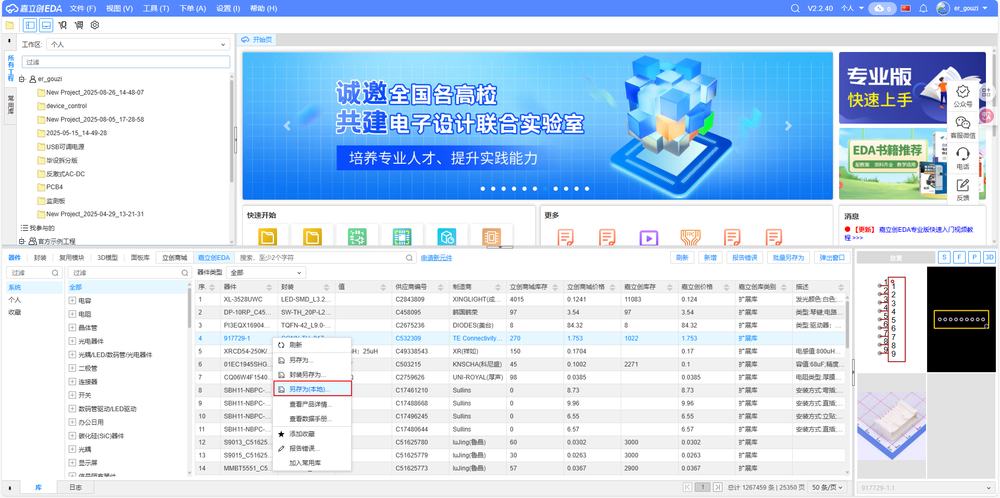
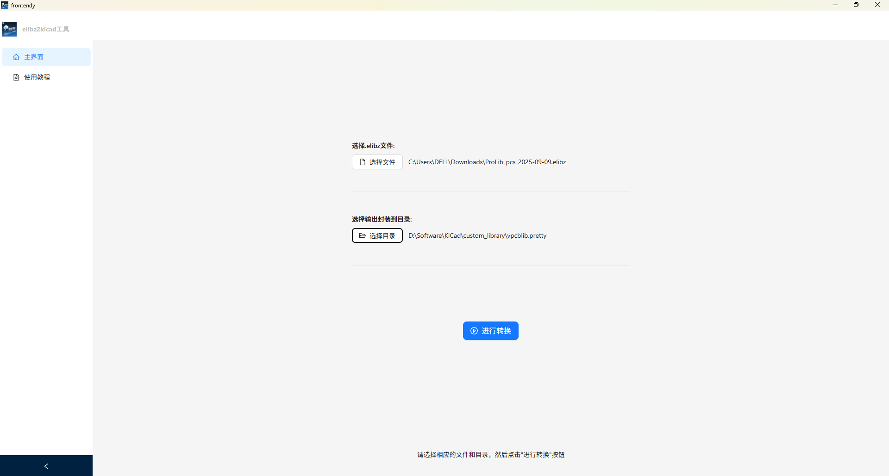
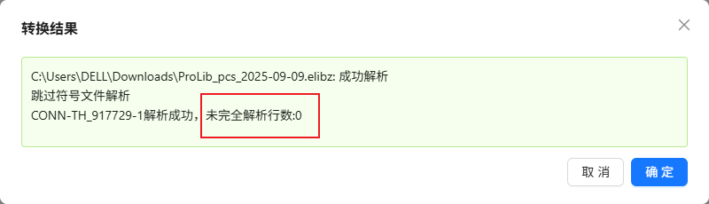

## 一、从立创EDA网页或应用上将元件另存为本地

## 二、选择.elibz文件、选择.kicad_mod存放的位置，点击转换




### 三、其它说明

1.层映射
```C
// 立创EDA -> kicad 

// 1 顶层 -> F.Cu
// 3 顶层丝印层 -> F.Silkscreen
// 5 顶层阻焊层 -> F.Mask
// 7 顶层锡膏层 -> F.Paste
// 9 顶层装配层 -> F.Fab

// 2 底层 -> B.Cu
// 4 底层丝印层 -> B.Silkscreen
// 6 底层阻焊层 -> B.Mask
// 8 底层锡膏层 -> B.Paste
// 10 底层装配层 -> B.Fab

// 11 板框层 -> Edge.Cuts
// 12 多层 -> F&B.Cu *.Mask
// 13 文档层 -> User.Drawings
// 14 机械层 -> null
// 56 钻孔图层 -> null
// 57 飞线层 -> null

// 48 元件外形层 -> F.Fab
// 49 元件标识层 -> User.7
// 50 引脚焊接层 -> User.8
// 51 引脚悬空层 -> User.9
```

2.当未完全解析行数不为0，说明存在部分未转换的图形

